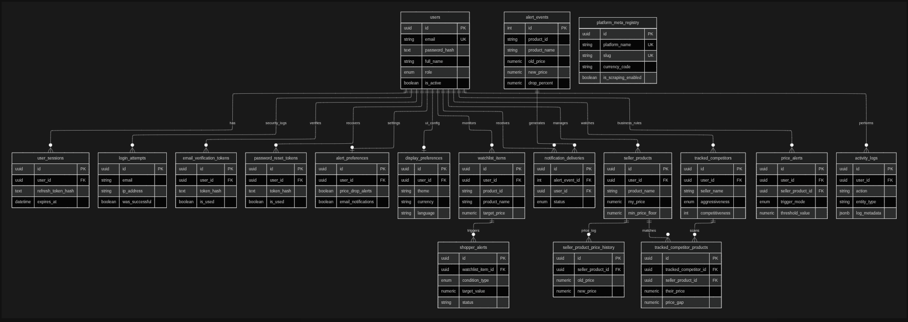

# E-commerce-Price-Intelligence-platform

A production-grade hybrid batch + streaming data platform for real-time e-commerce price monitoring and advanced analytics.

---

## Project Status

| Phase                                       | Status         | Date       |
| ------------------------------------------- | -------------- | ---------- |
| Phase 1: Project Setup & Infrastructure     | Complete       | 03-03-2026 |
| Phase 2: Local Environment (Docker Compose) | Complete       | 06-03-2026 |
| Phase 3: CI/CD Pipeline (maybe)             | In Progress    | —          |

---

## Architecture Overview

> Architecture diagram will be added here once the infrastructure phase is complete.

---

## Tech Stack

| Layer               | Technology                            |
| ------------------- | ------------------------------------- |
| Scraping            | Scrapy, BeautifulSoup, Selenium       |
| Streaming Ingestion | Apache NiFi                           |
| Batch Orchestration | Apache Airflow                        |
| Storage             | Google Cloud Bigtable                 |
| Transformation      | dbt                                   |
| Analytics           | Python, Pandas, SciPy, statsmodels    |
| Dashboard           | Angular (frontend), FastAPI (backend) |
| Visualization       | Plotly                                |
| Infrastructure      | Docker, Kubernetes, Terraform, GCP    |
| Monitoring          | Prometheus, Grafana                   |
| CI/CD               | GitHub Actions                        |

---

## Repository Structure

```
price-intelligence-platform/
│
├── .github/workflows/        # CI/CD pipelines
├── docker/Dockerfiles/       # One Dockerfile per service
├── airflow/                  # DAGs and plugins
├── nifi/                     # Flow templates and configs
├── dbt/                      # Models, tests, macros
├── scrapers/                 # Scraping logic
├── analytics/                # Notebooks and reports
├── app/                      # Frontend (Angular) + Backend (FastAPI)
├── infrastructure/           # Terraform, Monitoring, Scripts
├── tests/                    # Global tests
├── docker-compose.yml        # Local environment
└── .env.example              # Environment variables template
```

> For folder ownership per role, see [CONTRIBUTING.md](./CONTRIBUTING.md)

---

## Prerequisites

> This section will be updated as each service is configured.

Before running this project locally, make sure you have:

- [ ] Git
- [ ] Docker Desktop (with Docker Compose v2+)
- [ ] A free API key from [exchangerate-api.com](https://exchangerate-api.com)
- [ ] A GCP account _(required for Bigtable deployment — Phase 4)_

> Note: API key: To convert any price to USD automatically.

---

## Getting Started Locally

### 1. Clone the repository

- git clone https://github.com/M-Oubriche/E-commerce-Price-Intelligence-platform.git
- cd price-intelligence-platform

### 2. Create your local environment file

`Copy-Item .env.example .env`

Then open `.env` and fill in your real values:

- `EXCHANGE_RATE_API_KEY` → your key from exchangerate-api.com
- Everything else is already set correctly

### 3. Build the scraper image

`docker compose build`

> First build takes 5-10 minutes — Chrome installation is large. This is normal.

### 4. Run the scraper container

`docker compose run scraper`

### 5. Verify everything works

Inside the container run:

> - python --version # Expected: Python 3.11.xx
> - scrapy version # Expected: Scrapy 2.11.2
> - google-chrome --version # Expected: Google Chrome 1xx.x

### 6. Exit the container

> exit

### Scraped data location

All output files land here on your local machine:
data/raw/

---

## Deployment

> GCP deployment instructions will be added here once Terraform is configured (Phase 4).

---

## Monitoring & Observability

> Grafana dashboard access and Prometheus setup will be documented here (Phase 5).

---

## Pipeline Overview

> **Owner: Data Engineering**
> This section will be filled once scrapers, NiFi flows, Airflow DAGs, and dbt models are working.

<!--
When ready, document:
- How the scraper runs and what it collects
- NiFi flow description and routing logic
- Airflow DAGs names, schedule, and dependencies
- dbt models: staging → cleaned → aggregated
-->

---

## Analytics & Statistics

> **Owner: Data Analysis**
> This section will be filled once notebooks and reports are working.

<!--
When ready, document:
- What statistical analysis is performed (descriptive + inferential)
- How to run the notebooks (step by step)
- Where generated reports are saved
- Key insights and findings
-->

---

## Dashboard

> **Owner: Full Stack**
> This section covers the real-time interactive layer of the platform, including the price monitoring dashboards and the supporting API.

### 1. Backend API (FastAPI)

The backend provides a high-performance RESTful API and WebSocket support for real-time notifications.

#### Setup via Docker
The backend is automatically started with Docker Compose:
```bash
docker compose up backend -d
```
- **Port**: `8000`
- **Hot-Reload**: Enabled via volume mount (`./app/backend`)
- **Interactive Docs**: Available at `http://localhost:8000/docs` (Swagger UI)

#### Key API Endpoints
- **Authentication**: `POST /api/v1/auth/register`, `POST /api/v1/auth/login`
- **Watchlist**: `GET /api/v1/watchlist/`, `POST /api/v1/watchlist/`
- **Shopper Alerts**: `GET /api/v1/shopper-alerts/`, `POST /api/v1/shopper-alerts/`
- **Real-time Notifications**: `WS /ws/{user_id}` (Redis-backed WebSocket)

### 2. Frontend Dashboard (Angular)

A modern, responsive dashboard built with Angular 17+ and TailwindCSS.

#### Setup via Docker
The frontend is automatically started with Docker Compose:
```bash
docker compose up frontend -d
```
- **Port**: `4200`
- **Dev Server**: Runs with `--poll 2000` to ensure hot-reload works across Docker volumes.
- **Access**: `http://localhost:4200`

#### Core Features
- **Client (Shopper) Dashboard**:
  - **Price Watcher**: Track specific products across multiple platforms.
  - **Smart Alerts**: Configure target prices and notification channels.
  - **Deal Feed**: Real-time stream of detected price drops.
- **Reseller (Entrepreneur) Dashboard**:
  - **Catalog Tracker**: Manage and monitor your own product listings.
  - **Competitor Scanner**: Automatic matching and price-gap analysis.
  - **Business Analytics**: Margin protection and market visibility trends.

### 3. Database Schema (PostgreSQL)

The relational layer is hosted in the `app_postgres` container and managed via Alembic migrations.

#### Initialize Database Tables
To create or update the tables in your local environment, run the migrations using Docker:
```bash
docker compose exec backend alembic upgrade head
```

#### Database Schema Overview

The database consists of **18 tables** organized into five functional modules. 



**1. Identity & Security**
*   `users`: (id, email, password_hash, full_name, role, is_active, google_sub)
*   `user_sessions`: (id, user_id, refresh_token_hash, device_info, ip_address, expires_at)
*   `login_attempts`: (id, email, ip_address, was_successful, failure_reason)
*   `email_verification_tokens`: (id, user_id, token_hash, is_used, expires_at)
*   `password_reset_tokens`: (id, user_id, token_hash, is_used, expires_at)

**2. User Preferences**
*   `alert_preferences`: (id, user_id, price_drop_alerts, email_notifications, websocket_live)
*   `display_preferences`: (id, user_id, theme, language, currency, timezone)

**3. Shopper Features (Client Role)**
*   `watchlist_items`: (id, user_id, product_id, product_name, platform, target_price)
*   `shopper_alerts`: (id, user_id, watchlist_item_id, condition_type, target_value, status)
*   `alert_events`: (id, product_id, product_name, source, old_price, new_price, drop_percent)
*   `notification_deliveries`: (id, alert_event_id, user_id, channel, status, failed_reason)

**4. Reseller Intelligence (Reseller Role)**
*   `seller_products`: (id, user_id, product_name, my_price, min_price_floor, max_price_ceiling)
*   `seller_product_price_history`: (id, seller_product_id, old_price, new_price, recorded_at)
*   `tracked_competitors`: (id, user_id, seller_name, platform, aggressiveness, competitiveness)
*   `tracked_competitor_products`: (id, tracked_competitor_id, seller_product_id, their_price, price_gap)
*   `price_alerts`: (id, user_id, seller_product_id, trigger_mode, threshold_value, priority)

**5. System & Audit**
*   `platform_meta_registry`: (id, platform_name, slug, base_url, currency_code, is_scraping_enabled)
*   `activity_logs`: (id, user_id, action, entity_type, entity_id, log_metadata)

> **Note:** For exact field types (UUID, Numeric, etc.), refer to the models in `app/backend/models/`.

---

## Team

| Role             | Responsibilities                                              |
| ---------------- | ------------------------------------------------------------- |
| DevOps / DataOps | Infrastructure, Docker, CI/CD, monitoring, secrets management |
| Data Engineering | Scrapers, NiFi flows, Airflow DAGs, dbt models                |
| Data Analysis    | Statistical analysis, notebooks, reports                      |
| Full Stack       | Angular dashboard, FastAPI backend                            |

---

## Contributing

Please read [CONTRIBUTING.md](./CONTRIBUTING.md) before making any changes.
It contains the branching strategy, commit guidelines, PR workflow, and folder ownership rules.

---

## License

This project is licensed under the MIT License — see [LICENSE](./LICENSE) for details.
